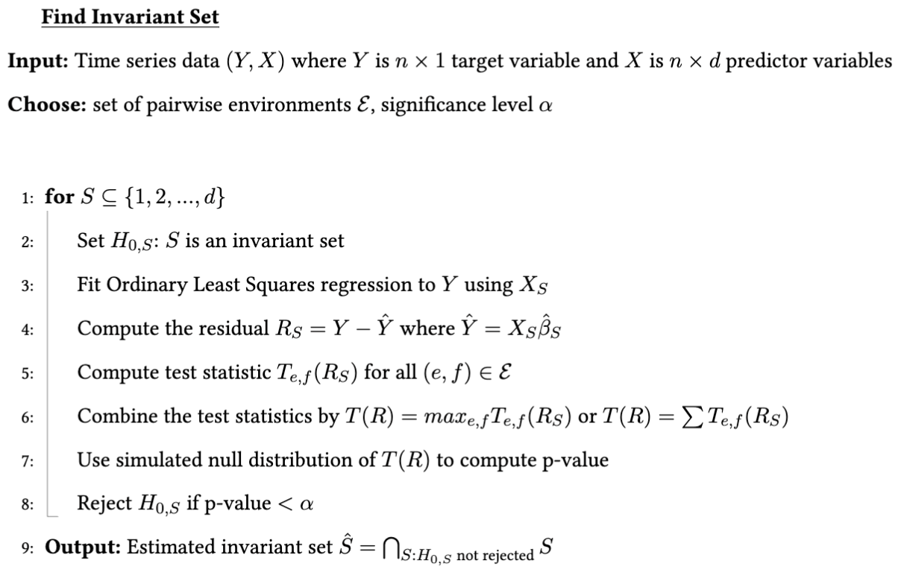
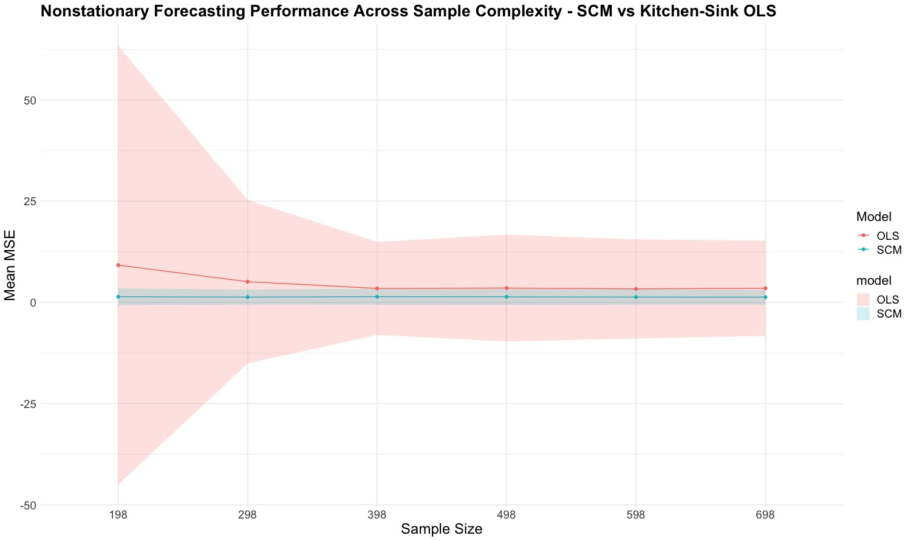

# Honors Thesis: Forecasting Non-Stationary Time Series with Causal Invariance

## Overview

This repository contains all the work for my honors thesis completed under the supervision of [Prof.Matteo Riondato](https://matteo.rionda.to/) at Amherst College, Computer Science Department. The thesis focuses on finding invariant causal mechanisms that enable robust time series forecasting in non-stationary environments. This project was funded by Amherst College [Gregory S. Call Undergraduate Research Fellowship](https://www.amherst.edu/academiclife/student-faculty-research/funding-for-student-research).

## Method

The method used in this paper was adapted from Pfister, Niklas, et al. “Invariant causal prediction for sequential data.” Journal of the American Statistical Association, vol. 114, no. 527, 13 Dec. 2018, pp. 1264–1276, https://doi.org/10.1080/01621459.2018.1491403.

## Preliminary Results

I found that understanding the causal structure underlying time series reduces the sample complexity of training forecasting models in non-stationary environments, offering a remarkable advantage over traditional covariance-based methods.

